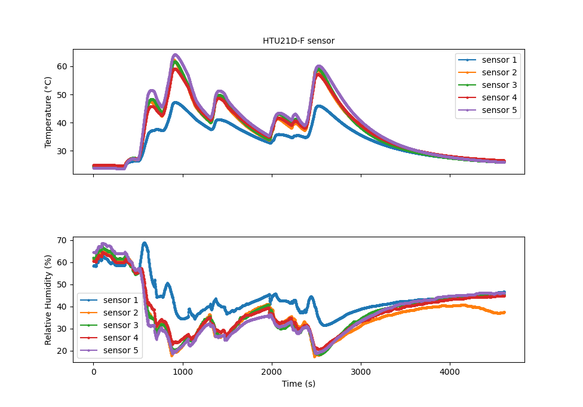
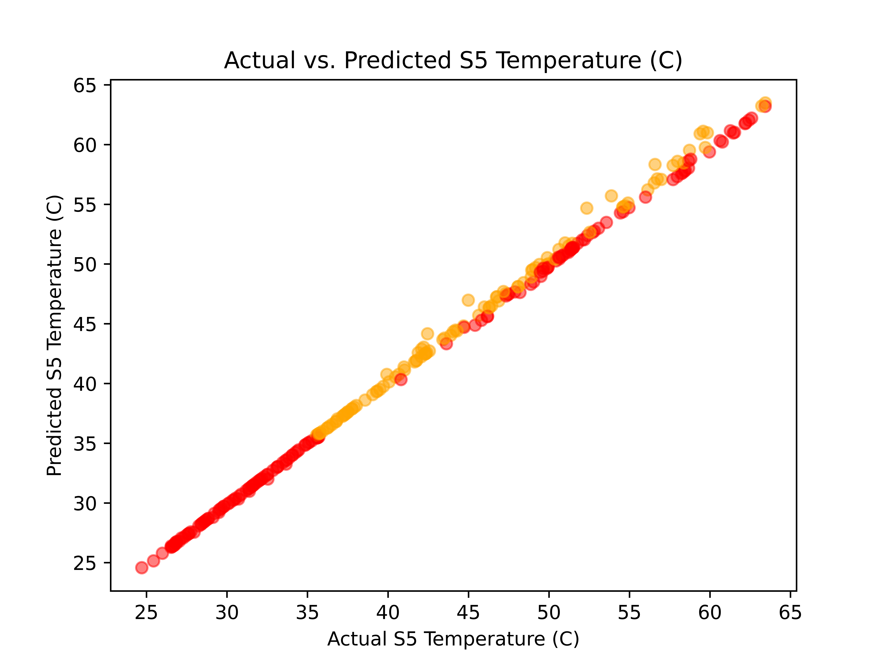

# HTU21D-F Temperature and Humidity Sensor

Welcome to the Arduino interface for the HTU21D-F temperature and humidity sensor. In this repository, you will find the necessary code and documentation to seamlessly connect and communicate with the HTU21D-F sensor using your Arduino board. This project empowers you to collect precise temperature and humidity data from the sensor and leverage it for a wide range of applications.

## Table of Contents

- [Introduction](#introduction)
- [Hardware Requirements](#hardware-requirements)
- [Installation](#installation)
- [Usage](#usage)

## Introduction

The HTU21D-F Temperature + Humidity Sensor is a highly accurate I2C digital humidity sensor, boasting an intelligent design. It provides precise humidity measurements with an impressive typical accuracy of ±2% within a range of 5% to 95% relative humidity. Temperature measurements are equally reliable, accurate within ±1°C, spanning from -30°C to 90°C.

The breakout board includes several features to enhance usability, including a PTFE filter for sensor protection, a 3.3V regulator, and I2C level shifting circuitry. This makes it compatible with microcontrollers operating at voltages ranging from 3.3V to 5V. The STEMMA QT form factor and connectors ensure straightforward interfacing, and it can be used seamlessly with SparkFun Qwiic I2C connectors. Each order includes a fully assembled PCB breakout and header, which may require soldering for use in a breadboard.

## Hardware Requirements

To kickstart your project, you will need the following hardware components:

- HTU21D-F Temperature and Humidity Sensor
- Arduino board (e.g., Arduino Nano, Seeeduino Xiao)
- Jumper wires
- USB hub

## Installation

1. **Wiring**: Begin by connecting the HTU21D-F sensor to your Arduino board using jumper wires. Ensure that you connect the VCC (3.3V), GND, SDA (A4 pin), and SCL (A5 pin) pins correctly. For guidance, you can refer to the datasheet or the example wiring diagram provided.

2. **Arduino IDE**: Confirm that you have the Arduino IDE installed on your computer. If it's not already installed, you can download it from the [Arduino website](https://www.arduino.cc/en/software). For Visual Studio users, PlatformIO is employed in this project.

3. **Library Installation**: Install the HTU21D-F sensor library for Arduino. You can achieve this through the Arduino Library Manager. Open the Arduino IDE, navigate to `Sketch > Include Library > Manage Libraries`, search for "HTU21D-F," and then click "Install." If you're using PlatformIO, you must add the following to your Platformio.ini file:

   ```
   [env:nanoatmega328new]
   platform = atmelavr
   board = nanoatmega328new
   framework = arduino
   lib_deps = adafruit/Adafruit HTU21DF Library@^1.1.2
   ```

4. **Upload Code**: Launch the Arduino IDE and load the example sketch found in this repository (`arduino_HTU21D_F_with_LED_blink.cpp`). Then, upload the code to your Arduino board.

## Usage

1. After successfully uploading the code to your Arduino, open the Serial Monitor by navigating to `Tools > Serial Monitor` in the Arduino IDE.
2. Set the baud rate in the Serial Monitor to the same value specified in the Arduino code, typically 9600 baud.
3. The sensor will initiate the process of reading temperature and humidity data and promptly display it within the Serial Monitor.
4. You can leverage this data for your specific project or tailor the code to meet your specific requirements.

## Reading using VC

If you prefer to read the thermometer output via a serial connection in VC (Visual Studio), you can utilize the provided script (`read_HTU21d.py`). This script allows you to read the data, and if you wish to visualize the results, you can use `plot_multiples_HTU21D.py`.

Feel free to explore and adapt this interface to meet your unique project needs.



## AI-based thermometer
I deployed multiple thermometers around the target location, collected data, and employed machine learning to predict and present the results for the target location.



